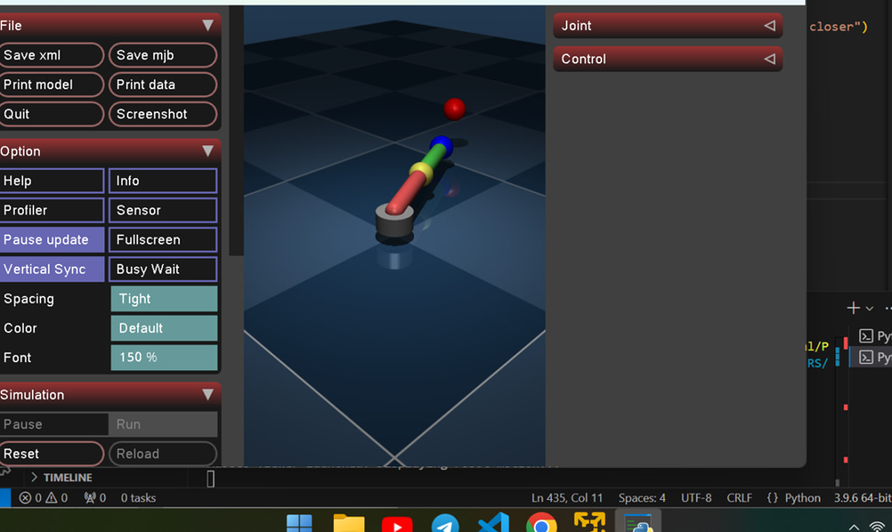
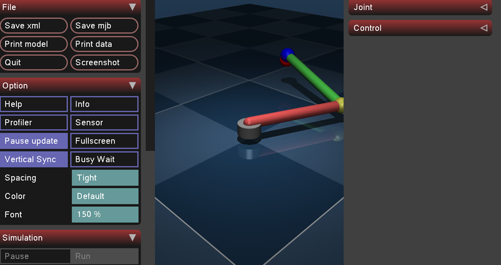
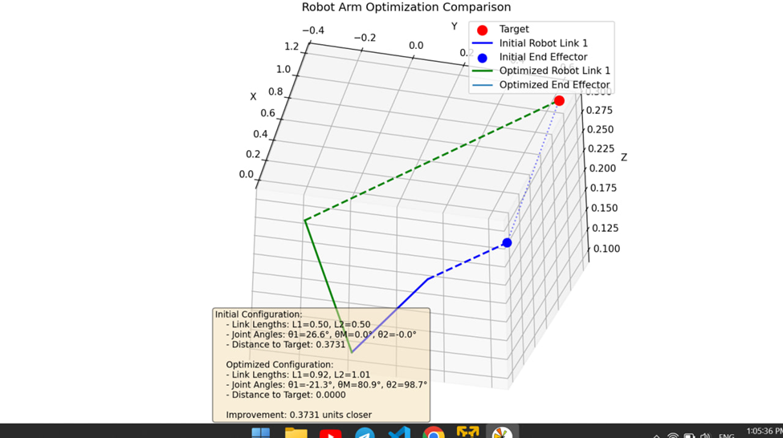

# 2R-RobotArm-Optimization-MuJoCo



# 🦾 2R Robotic Arm Inverse Kinematics with Optimization (MuJoCo + L-BFGS-B)

This project demonstrates a simulation and optimization pipeline for controlling a 2-link robotic arm using inverse kinematics. The robot is modeled in [MuJoCo](https://mujoco.readthedocs.io/) and uses the L-BFGS-B optimization algorithm to compute joint angles that allow the end-effector to reach a target location.
##How to Run
Clone the repository:
git clone https://github.com/Imotechs/2R-RobotArm-Optimization-MuJoCo.git
cd 2R-RobotArm-Optimization-MuJoCo
pip install -r requirements.txt
Run the simulation: python main.py

## 🚀 Project Overview

Robotic manipulation often requires precise positioning of the end-effector. Instead of solving inverse kinematics analytically—which can be restrictive and complex for certain configurations—this project uses **numerical optimization** to determine joint configurations automatically.

### Features:
- 2-link robotic arm modeled in MuJoCo.
- Gradient-based optimization with `L-BFGS-B` algorithm.
- Real-time simulation of the optimized pose reaching a predefined target.

## 🧠 Optimization Approach

We minimize the Euclidean distance between the end-effector and the target by adjusting joint angles. This is done using:

```python
scipy.optimize.minimize(
    joint_angle_cost_function,
    initial_angles,
    args=(robot,),
    method='L-BFGS-B',
    bounds=[(-π, π), (0, π/2)]
)
